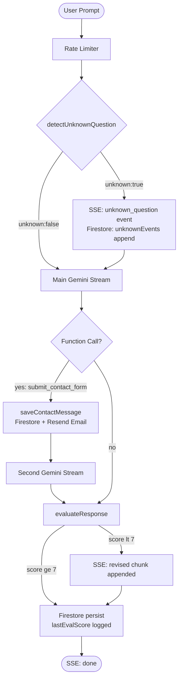

# Portfolio Chatbot — Agent Architecture

> **File:** `docs/agent-architecture.md`  
> **Last updated:** 2026-02-25  
> **Scope:** `src/app/api/chat/route.ts`

---

## 1. Overview

This document describes the two agentic tools added to the portfolio chatbot (`/api/chat`):

| Tool | Purpose |
|---|---|
| **Unknown Question Detection** | Detects when a user question is out of the chatbot's scope before generating a response |
| **Response Evaluator (Self-Critic)** | Evaluates the AI's response after generation and triggers an automatic revision if quality is low |

Both tools use lightweight **LLM-as-a-Judge** prompts with `gemini-2.0-flash-lite` to minimise latency and cost.

---

## 2. System Architecture

### 2.1 Agent Loop Design

Each POST request to `/api/chat` follows this agent loop:

```
User Prompt
    │
    ▼
[Rate Limiter]
    │
    ▼
[1] detectUnknownQuestion()     ← Non-streaming Gemini call
    │
    ├── unknown: true  →  SSE: type="unknown_question"
    │                      Firestore: unknownEvents[] (async)
    │                      (continues — does NOT block response)
    │
    └── unknown: false → (continues silently)
    │
    ▼
[2] Main Chat (gemini-2.5-flash-lite)  ← Streaming
    │  ┌─ chunk by chunk → SSE: type="chunk"
    │  └─ function call? → submit_contact_form → second stream
    │
    ▼
[3] evaluateResponse()          ← Non-streaming Gemini call
    │
    ├── score >= 7  →  (no action, score logged)
    │
    └── score < 7   →  SSE: type="chunk" (revised text appended)
    │
    ▼
[4] Firestore persist
    │  messages[], updatedAt, lastEvalScore
    │
    ▼
SSE: type="done"
```

### 2.2 Tool Invocation Mechanism

Both tools are invoked as **regular async function calls** within the existing `ReadableStream` handler. No new HTTP endpoints are needed.

```
POST /api/chat
  └── ReadableStream.start()
        ├── detectUnknownQuestion(apiKey, prompt, portfolioContext)
        ├── ... main streaming chat ...
        └── evaluateResponse(apiKey, prompt, fullText)
```

### 2.3 Prompt Design

#### detectUnknownQuestion — Scope Judge

```
System role: scope-detection agent
Input:       short context summary (≤600 chars) + user message
Output JSON: { "unknown": bool, "reason": string, "confidence": 0-100 }
```

- Uses only ≤600 chars of context to keep tokens minimal
- Returns `unknown: false` on any parsing failure (never blocks)
- Out-of-scope triggers: legal, financial, medical advice; unrelated tech support; personal lives of others; salary negotiation

#### evaluateResponse — Self-Critic

```
System role: strict quality evaluator
Input:       user question + AI response
Rubric:      professional tone (1-3) | clarity (1-3) | safety (1-2) | relevance (1-2)
Output JSON: { "score": 1-10, "feedback": string, "revised"?: string }
Threshold:   score < 7  →  "revised" field required
```

- On failure, returns `score: 10` so the main flow is never disrupted
- `revised` text is streamed as additional chunks after the original response

---

## 3. Flow Diagram



---

## 4. Test Cases

### Test Case 1 — Standard Interview / Portfolio Question

**Input:** `"Efe'nin projeleri neler?"`

| Step | Expected outcome |
|---|---|
| Unknown Detection | `unknown: false` — within scope |
| Main Response | Lists projects from Firestore context |
| Evaluator | `score >= 7` — no revision |
| Firestore | `lastEvalScore: ≥7`, no `unknownEvents` |
| User sees | Normal streaming response |

---

### Test Case 2 — Technical Question (in scope)

**Input:** `"What technologies does Efe use for full-stack development?"`

| Step | Expected outcome |
|---|---|
| Unknown Detection | `unknown: false` — clearly in scope |
| Main Response | Lists tech stack from context |
| Evaluator | `score >= 7` — no revision |
| Console | `[Evaluator] score=8 | Clear and complete` |
| User sees | Normal streaming response |

---

### Test Case 3 — Unknown / Out-of-Scope Question

**Input:** `"Can you give me legal advice about my employment contract?"`

| Step | Expected outcome |
|---|---|
| Unknown Detection | `unknown: true`, `reason: "legal advice"`, `confidence: 90+` |
| SSE event | `{ type: "unknown_question", reason: "...", confidence: 92 }` |
| Firestore | `unknownEvents` array gets a new entry |
| Console | `[UnknownDetection] Out-of-scope question (confidence 92%): legal advice` |
| Main Response | Still runs — AI politely declines and redirects to Efe's contact |
| Evaluator | Evaluates the decline response normally |
| User sees | Polite decline (does NOT see the unknown_question event — it's a log only) |

---

## 5. Design Decisions

### 5.1 Minimum Code Changes
Both tools are self-contained functions added **above** the `POST` handler. The handler itself gains only ~30 lines. The existing streaming loop, function-call handling, and Firestore persistence are untouched.

### 5.2 LLM-as-a-Judge over Rule-Based
Rule-based keyword detection is fragile. A second LLM call is more accurate for natural language scope detection and quality evaluation. Using `gemini-2.0-flash-lite` keeps latency low (~200–400ms per call).

### 5.3 Never Block the Main Flow
Both tools use `try/catch` with safe defaults (`unknown: false`, `score: 10`). If either tool fails, the user still gets a response.

### 5.4 Async Firestore Log for Unknown Events
The `unknownEvents` Firestore write is intentionally **non-blocking** (`.catch(() => {})`). It must not delay the main stream.

### 5.5 Revised Response as Appended Chunk (Seçenek A)
The evaluator runs **after** streaming. If the score is below the threshold, the revised text is appended as an additional SSE chunk. This avoids rewriting the streaming architecture. A future improvement (Seçenek B) would collect the full response first, evaluate, and then stream only the final version.

---

## 6. Failure Cases & Mitigations

| Failure | Mitigation |
|---|---|
| `detectUnknownQuestion` Gemini call times out | Returns `{unknown: false}` — main flow continues |
| `evaluateResponse` JSON parse error | Returns `{score: 10}` — no revision triggered |
| `evaluateResponse` returns `score < 7` but no `revised` | `if (evalResult.revised)` guard — no chunk appended |
| Firestore `unknownEvents` write fails | Swallowed `.catch(() => {})` — user unaffected |
| Both extra calls add latency | Each adds ~200–400ms **after** streaming starts; user is already reading the response |

---

## 7. Reflection

Building both tools within the existing route rather than as separate microservices keeps deployment simple (Vercel Edge / serverless). The main trade-off is that both extra Gemini calls run serially with the main request, adding latency. For a personal portfolio site with low traffic, this is acceptable.

Potential future improvements:
- **Seçenek B evaluator:** Buffer full response → evaluate → stream final version (better UX)
- **Human escalation webhook:** When `unknown: true`, POST to a Slack/Discord webhook in addition to Firestore logging
- **Dashboard view:** Surface `lastEvalScore` and `unknownEvents` in the admin panel analytics page
